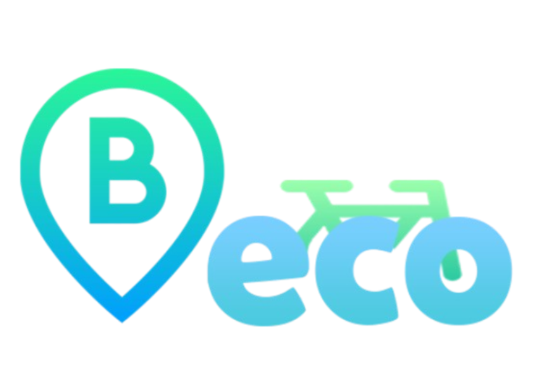

# BECO - Bike Hub


## Languages and Technologies


## Project Overview
BECO, short for Bike Eco, is a revolutionary project aimed at enhancing urban mobility and reducing environmental footprint through a smart bike hub system. This system integrates seamlessly with city infrastructure to provide efficient, eco-friendly bike parking solutions, repair services, and user engagement through an interactive application.

## Features
- **Smart Bike Storage**: Automated bike parking to maximize space efficiency and security.
- **Repair Services**: On-demand bike maintenance and repair options.
- **User-Friendly App**: Real-time access to parking availability, navigation, and payment systems.
- **Sustainable Practices**: Focus on reducing carbon emissions and promoting green energy.

## Technology Stack
- **Frontend**: Java, XML
- **Backend**: Firebase Realtime Database
- **Hardware**: Raspberry Pi, running on Ubuntu OS
- **IDE**: Android Studio for application development

## Installation
1. **Clone the repository**:
   ```bash
   git clone https://github.com/yourgithub/beco.git
